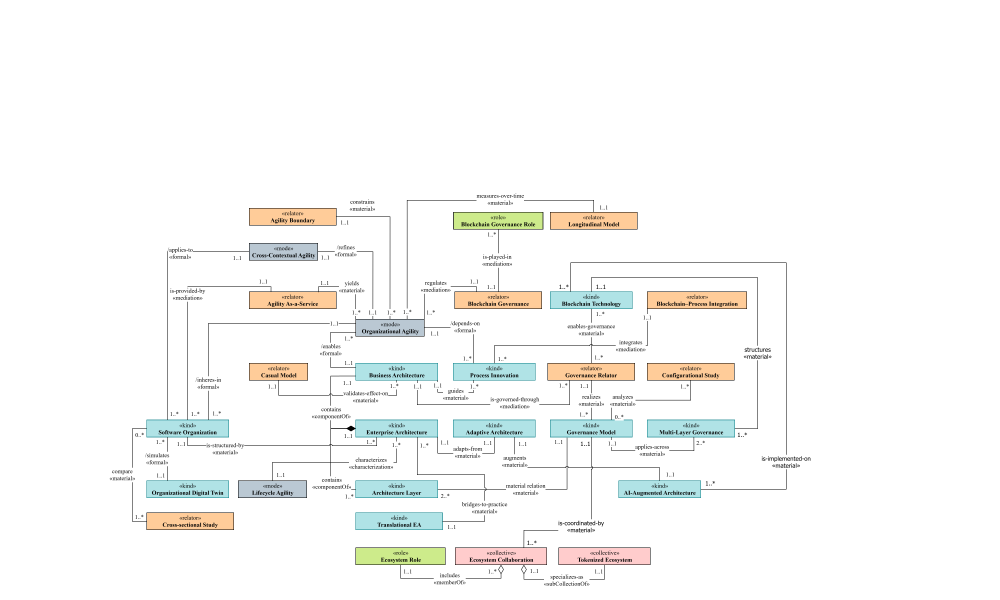

# A systematic reference conceptual model for Software-Led Enterprises (CM4SLE)

## About
A systematic reference conceptual model for Software-Led Enterprises (CM4SLE), based on the Unified Foundational Ontology (UFO).

## Introduction
The CM4SLE (Conceptual Model for Software-Led Enterprises) is a systematic reference conceptual model designed to capture and analyze the architecture of software-led organizations. Grounded in the Unified Foundational Ontology (UFO), this model embeds blockchain-related capabilities into business architecture, highlighting their potential role in enabling organizational agility, ecosystem collaboration, and future-oriented enterprise design. CM4SLE provides both a rigorous theoretical framework and a practical reference point for researchers and practitioners interested in digital transformation, blockchain adoption, and enterprise modeling.

## Note
> **Note:** CM4SLE is an evolving conceptual model that will be refined and extended over time as the research progresses.  
> This repository captures version 1.0 of the model, which represents the current state of development.  
> Users should note that this version may not be complete or entirely free of limitations; future updates will incorporate improvements, extensions, and corrections based on ongoing research and feedback.

## Authors and Affiliations

- **1st Neda Seyedin Hashemi**  
  Faculty of Computer Engineering  
  Islamic Azad University, Tehran, Iran  
  ORCID: [0009-0007-9783-8588](https://orcid.org/0009-0007-9783-8588)

- **2nd Aylar Ziapour Sohi**  
  Department of Computer Engineering and Artificial Intelligence  
  Islamic Azad University, Karaj, Iran  
  ORCID: [0009-0007-4031-8071](https://orcid.org/0009-0007-4031-8071)

- **3rd Araz Saie Arasi**  
  Department of Computer Engineering, Ra.C., Islamic Azad University, Rasht, Iran  
  ORCID: [0009-0009-6739-5717](https://orcid.org/0009-0009-6739-5717)

- **4th Aidin Ziapour Sohi**  
  Department of Computer and Information Technology Engineering  
  Islamic Azad University, Qazvin, Iran  
  ORCID: [0009-0002-2303-7992](https://orcid.org/0009-0002-2303-7992)

- **5th Mahmood Neshati**  
  Department of Software and Information Systems, Faculty of Engineering and Computer Science  
  Shahid Beheshti University, Tehran, Iran  
  ORCID: [0000-0002-3953-4857](https://orcid.org/0000-0002-3953-4857)

## Model Domains

The conceptual domains of CM4SLE highlight the core, futuristic, and gap-bridging constructs that together form the foundation of the model.  

  

## CM4SLE 1.0 Model

The CM4SLE 1.0 conceptual model integrates blockchain-enabled governance, ecosystem collaboration, and agility mechanisms into a unified architecture grounded in UFO.  

  

## Summary

The CM4SLE repository provides visual and editable artifacts of the model.  
All related files, including **.drawio**, **.svg**, and **.png** formats, are available in the `Model` folder for download in high quality and for further use in research or practice.
